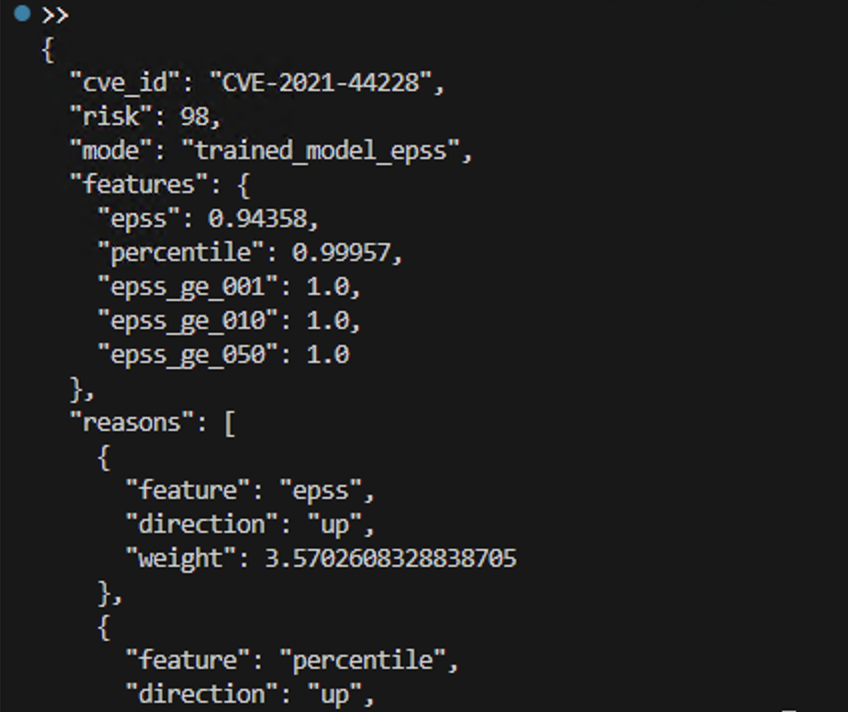

> **Day0Predictor** — Early exploitation risk scoring for CVEs using EPSS + ML  
> Defensive research tool · Transparent scoring · No “zero-day” hype
> 
# Day0Predictor v0.1

**EPSS-Integrated Early Exploitation Risk Scoring (Defensive)**

Day0Predictor is a defensive security tool that estimates **early exploitation risk** for known CVEs by combining:

* **EPSS (Exploit Prediction Scoring System)** data
* Lightweight ML models
* Transparent feature-based explanations

> ⚠️ This tool **does not predict unknown vulnerabilities**.
> It scores **likelihood of exploitation** for already-disclosed CVEs to help with **prioritization and triage**.

---

## 🔍 Demo (Real Output)



Example output for **CVE-2021-44228 (Log4Shell)**:

* Risk score: **98 / 100**
* Mode: **trained_model_epss**
* Explanation: EPSS score, percentile, and threshold indicators

---

## ✨ Features

* 📊 **EPSS-driven risk scoring**
* 🧠 **Trained ML model with explanations**
* 🪜 **Graceful fallback** (heuristics if no model exists)
* 📄 **JSON & text output**
* 🔍 **Explainable reasons per score**
* 🧪 Fully tested pipeline

---

## 📦 Installation

```bash
git clone https://github.com/ethicals7s/day0predictor-v0.1.git
cd day0predictor-v0.1
python -m venv .venv
source .venv/bin/activate  # Windows: .venv\Scripts\Activate.ps1
pip install -e .
```

---

## 🚀 Quick Start

### 1️⃣ Fetch EPSS data

```bash
python scripts/fetch_nvd.py
```

### 2️⃣ Build the dataset

```bash
python scripts/build_dataset.py
```

### 3️⃣ Train the model

```bash
python scripts/train.py
```

---

## 🧪 Score a CVE by ID (Recommended)

```bash
day0predict score-epss \
  --cve-id CVE-2021-44228 \
  --model models/day0predict.joblib \
  --format json
```

---

## 📂 Score a CVE JSON File

```bash
day0predict score \
  --file examples/cve_sample.json \
  --model models/day0predict.joblib \
  --format json
```

---

## 🧠 Output Schema (JSON)

```json
{
  "cve_id": "CVE-2021-44228",
  "risk": 98,
  "mode": "trained_model_epss",
  "features": { "...": "..." },
  "reasons": [
    { "feature": "epss", "direction": "up", "weight": 3.57 }
  ],
  "disclaimer": "Defensive risk scoring only."
}
```

---

## 🛡️ Disclaimer

This project is intended **for defensive security purposes only**:

* Vulnerability prioritization
* Risk triage
* Blue-team analytics

It is **not** a zero-day discovery system.

---

## 📌 Roadmap

* ⏳ Time-based CVE splits
* 📈 Model calibration
* 🌐 REST API
* 🧩 SBOM / asset context
* 🧠 SHAP-style explanations

---

## ⭐ Star the Project

If this helped your work or research, a ⭐ on GitHub helps others discover it.

---

**Author:** @ethicals7s
**License:** MIT
